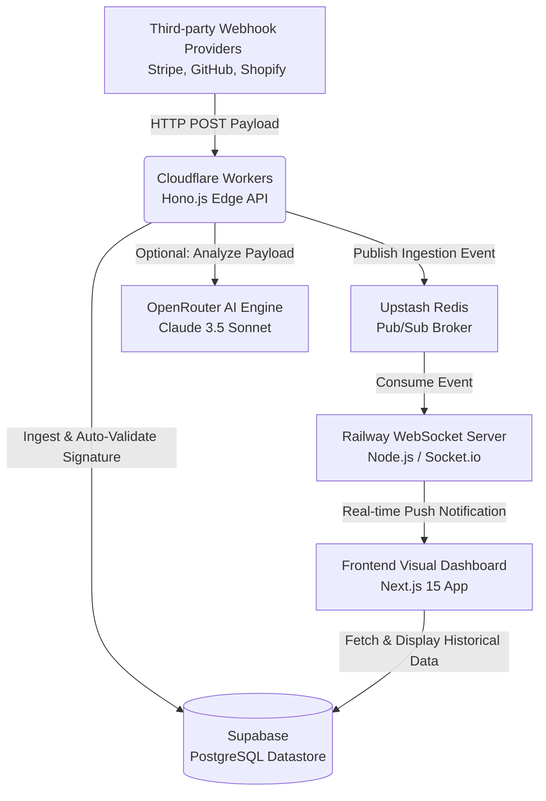
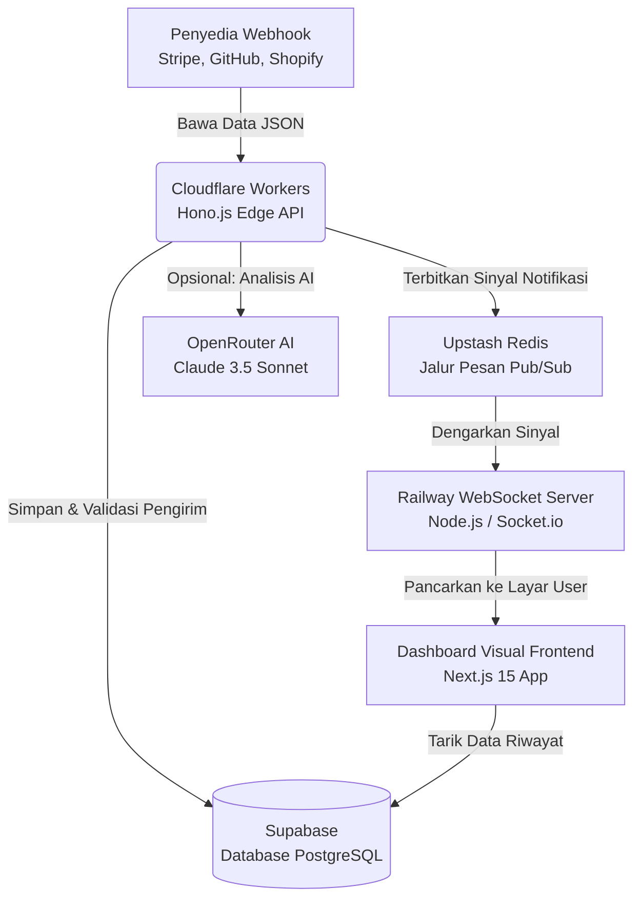

  <h1>🔍 HookLens</h1>
  
<b>The Ultimate Real-time Visual Webhook Debugger & Analyzer</b>

  
<i>Crafted by <b>Kazanaru</b> • Built for Modern Developer Workspaces</i>

  
  

    <a href="#-english-documentation">🇬🇧 English</a> •
    <a href="#-dokumentasi-bahasa-indonesia">🇮🇩 Bahasa Indonesia</a>
  

  <h3>💻 Tech Stack</h3>
  

    
    
    
    
    
    
    
    
  

---

## 🇬🇧 English Documentation

### ⚠️ The Developer Problem

Webhooks are the connective tissue of modern internet architectures, yet debugging them remains a fragmented and painful experience for developers:

- **Silent Failures:** Developers often lack visibility into the exact payload structures sent by third-party providers (e.g., Stripe, Shopify) until a crash occurs in production.
- **Exposing Localhost:** Testing webhooks locally requires exposing private servers to the public internet using tunneling tools (like ngrok), which are slow, tedious to manage, and pose security risks.
- **Complex Signature Validation:** Writing and maintaining cryptographic signature validation code (HMAC/SHA) across different providers is repetitive and prone to critical security vulnerabilities.
- **Traceability Zero:** When a webhook fails, traditional logs bury the context. Teams struggle to collaborate, inspect headers, or forward the failed payload for local replay.

### 💡 The Solution: HookLens

**HookLens** elegantly intercepts, serializes, visualizes, and analyzes webhook payloads in real-time. It acts as an enterprise-grade inspection proxy between webhook providers and your core backend.

Designed with a **20-year professional engineering standard**, HookLens eliminates the guesswork by providing a dedicated workspace to catch, inspect, and replay webhooks securely.

#### ✨ Core Capabilities

1. **Real-time Telemetry:** Visualize incoming HTTP requests, headers, and JSON bodies instantly via zero-latency WebSockets (<500ms delivery).
2. **AI-Powered Diagnostics:** Integrated AI (Claude 3.5) automatically scans incoming JSON payloads, detects schema anomalies, and suggests integration fixes.
3. **Localhost Replay:** Resend caught webhooks directly to your local development environment with a single click—no ngrok required.
4. **Automated Security:** Auto-validates incoming cryptographic signatures from major providers out of the box.
5. **Team Collaboration:** Share isolated endpoint URLs with your team and utilize threaded comments directly on specific payloads.
6. **Uptime Monitoring:** Generates synthetic checks and alerts Slack/Discord when your webhook consumption success rate drops.

### 🏗 Architecture Flowchart

### 🛠 Comprehensive Tech Stack

HookLens is built using a modern, deeply optimized, and horizontally scalable stack:

**Frontend Ecosystem:**

- **Framework:** Next.js 15 (React 19, Server Components)
- **Styling:** Tailwind CSS v4 + Shadcn UI
- **State & Data Fetching:** Zustand, React Query (TanStack)
- **Real-time Client:** Socket.io-client
- **Code Editor:** Monaco Editor (for JSON visualization)
- **Data Visualization:** Recharts

**Backend Ecosystem (Serverless Edge):**

- **Framework:** Hono.js (Optimized for Cloudflare Workers)
- **Deployment & Cron:** Cloudflare Workers (`wrangler`)
- **Validation & Parsing:** Zod & Ajv (JSON Schema)
- **Cryptography:** Web Crypto API (AES-256 for signing secrets)

**Real-time Streaming Engine:**

- **Server:** Node.js + Socket.io (Hosted on Railway)
- **Message Broker:** Upstash Redis (Serverless Pub/Sub)

**Database & Storage:**

- **ORM:** Drizzle ORM
- **Database:** Supabase (PostgreSQL with Time-series indexing patterns)

**Integrations:**

- **Authentication:** JWT (JSON Web Tokens)
- **Payments:** Stripe Checkout & Webhooks
- **AI Analytics:** OpenRouter (Claude 3.5 Model)

---

## 🇮🇩 Dokumentasi Bahasa Indonesia

### ⚠️ Masalah Developer (Kenapa Webhook Sulit?)

Webhook adalah fondasi komunikasi _real-time_ di internet modern. Sayangnya, proses _debugging_ integrasi webhook seringkali menjadi mimpi buruk:

- **Gagal Tanpa Jejak:** Developer sering meraba-raba bentuk struktur data (_payload_) yang dikirimkan oleh layanan pihak ketiga (seperti Stripe atau GitHub) sampai akhirnya terjadi _error/crash_ di server utama.
- **Testing Lokal yang Repot:** Memeriksa webhook di komputer lokal mengharuskan developer menggunakan _tunneling_ publik seperti ngrok. Hal ini merepotkan, lambat, dan memiliki risiko keamanan tinggi.
- **Validasi Keamanan yang Rumit:** Mencocokkan kode keamanan kriptografi (Tanda Tangan HMAC/SHA) dari berbagai penyedia layanan sangat membuang waktu dan rentan menghasilkan celah keamanan (bocor).
- **Sulit Kolaborasi:** Jika sebuah webhook gagal masuk, log sistem biasa sangat sulit dibaca. Tim tidak punya tempat terpusat untuk mendiskusikan error dari _request_ web tertentu.

### 💡 Solusi: HookLens

**HookLens** hadir untuk menangkap, memvisualisasikan, dan menganalisis kiriman webhook Anda secara _real-time_. Aplikasi ini bekerja layaknya "kaca pembesar" dan perantara inspeksi profesional antara penyedia Webhook dan server aplikasi utama Anda.

Dirancang dengan **standar rekayasa perangkat lunak profesional tingkat senior (20 Tahun Pengalaman)**, HookLens menghilangkan tebak-tebakan dalam pemrograman dengan memberikan ruang kerja khusus untuk menangkap, memeriksa, dan mengirim ulang webhook dengan aman.

#### ✨ Fitur Utama

1. **Inspeksi Real-time:** Lihat lalu lintas HTTP, _headers_, dan isi JSON yang masuk dalam sekejap mata lewat koneksi WebSockets tanpa perlu me-_refresh_ halaman.
2. **Diagnosis Berbasis AI:** Kecerdasan Buatan bawaan (Claude 3.5) akan membedah isi data JSON Anda, menemukan eror, dan memberikan saran perbaikan kodenya secara otomatis.
3. **Meneruskan ke Localhost:** Kirim ulang webhook yang berhasil ditangkap langsung ke server lokal (_localhost_) komputer Anda hanya dengan 1 klik—tanpa repot membuka ngrok.
4. **Keamanan Otomatis:** Memeriksa kesahihan keaslian kriptografi pengirim (Token/Signature Validation) dari layanan API ternama tanpa perlu pemograman tambahan.
5. **Kolaborasi Tim:** Bagikan URL Endpoint (_workspace_) ke rekan satu tim, dan gunakan fitur komentar di dalam setiap data webhook untuk berdiskusi layaknya forum.
6. **Pemantauan Uptime:** Menghitung rasio kesuksesan webhook Anda dan akan mengirimkan peringatan (Alert) ke Slack/Discord jika persentase fungsinya menurun.

### 🏗 Alur Arsitektur (Flowchart)

### 🛠 Spesifikasi Teknologi Lengkap

HookLens dibangun menggunakan tumpukan (_stack_) teknologi yang sangat modern, teroptimasi, dan bisa diskalakan untuk jutaan request (kelas _Enterprise_):

**Ekosistem Frontend (Antarmuka):**

- **Kerangka Kerja:** Next.js 15 (React 19 dengan Server Components)
- **Tampilan Visual:** Tailwind CSS v4 + Shadcn UI
- **Penyimpanan State:** Zustand & React Query
- **Koneksi Real-time:** Socket.io-client
- **Kode Editor Tanam:** Monaco Editor (Untuk perwarnaan format JSON)
- **Grafik Analitik:** Recharts

**Ekosistem Backend (Edge API):**

- **Kerangka Kerja:** Hono.js (Super cepat di Jaringan Tepi / _Edge_)
- **Penyebaran / Cloud:** Cloudflare Workers (Ditambah Cron Triggers)
- **Validasi Data:** Zod & Ajv Validations (JSON Schema)
- **Enkripsi Web:** Web Crypto API standar keamanan bank (AES-256)

**Mesin Siaran Real-time (WebSocket):**

- **Server Inti:** Node.js + Socket.io (Dihosting stabil di Railway)
- **Pesan Antar Jaringan:** Upstash Redis (Jalur ganda Pub/Sub)

**Database & Penyimpanan:**

- **Jembatan Kode (ORM):** Drizzle ORM
- **Database Utama:** Supabase (Teknologi PostgreSQL canggih)

**Integrasi Eksternal:**

- **Autentikasi Lapis Ganda:** Perlindungan Token JWT
- **Sistem Pembayaran Profesional:** Infrastruktur Stripe Stripe
- **Penggerak AI Analisis:** OpenRouter (Model Claude 3.5 Sonnet Terbaik)

---

  
🚀 <b>Start debugging your webhooks elegantly today.</b>

  
&copy; 2026 Kazanaruishere. <i>All Intelligent Patterns Reserved.</i>

