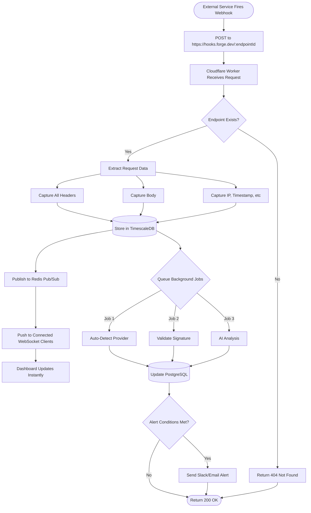
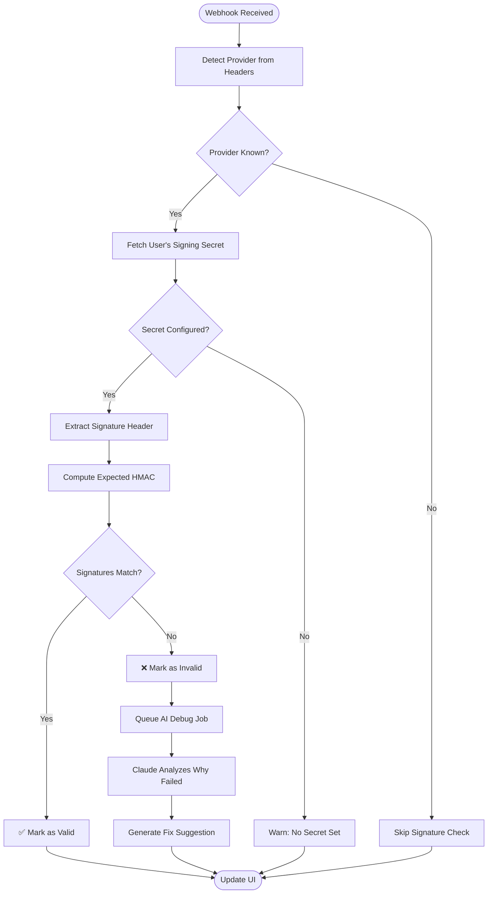
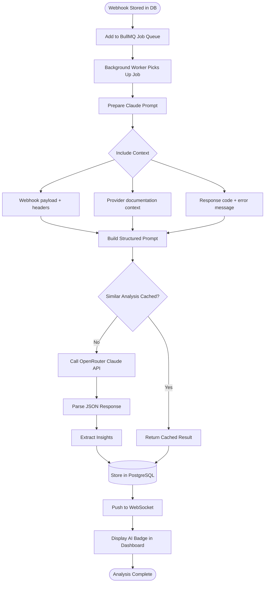
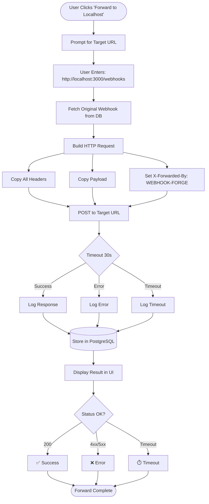

# 🪝 WEBHOOK-FORGE - Visual Webhook Testing & Debugging Platform

> **Debug webhooks 10x faster with AI-powered analysis and real-time inspection**

---

## 📋 Table of Contents

1. [Executive Summary](#executive-summary)
2. [Problem Statement](#problem-statement)
3. [Solution Overview](#solution-overview)
4. [Core Features](#core-features)
5. [Technical Architecture](#technical-architecture)
6. [Tech Stack](#tech-stack)
7. [System Flowchart](#system-flowchart)
8. [Database Schema](#database-schema)
9. [API Architecture](#api-architecture)
10. [AI Implementation](#ai-implementation)
11. [Business Model](#business-model)
12. [Go-to-Market Strategy](#go-to-market-strategy)
13. [14-Day Implementation Roadmap](#14-day-implementation-roadmap)
14. [Competitive Analysis](#competitive-analysis)
15. [Risk Assessment](#risk-assessment)
16. [Future Roadmap](#future-roadmap)

---

## 📊 Executive Summary

**WEBHOOK-FORGE** is a modern webhook testing and debugging platform that helps developers build, test, and monitor webhook integrations 10x faster. With AI-powered payload analysis, real-time inspection, and team collaboration features, WEBHOOK-FORGE solves the #1 pain point in API development.

**Key Differentiators:**
- **AI Debugger** (Claude analyzes errors instantly) vs **Manual debugging**
- **Real-time Updates** (WebSocket) vs **Refresh page repeatedly**
- **Auto-Signature Verification** (Stripe, GitHub, Shopify) vs **Manual validation**
- **Team Collaboration** (share, comment, assign) vs **Solo debugging**

**Target Market:**
- E-commerce developers (Shopify: 2M+ stores)
- Payment integration devs (Stripe: 3M+ developers)
- SaaS builders (every SaaS uses webhooks)
- Total Addressable Market: $1.2B

**Revenue Projection (Year 1):**
- Month 3: 100 users × $12 = $1,200/month
- Month 6: 500 users × $12 = $6,000/month
- Month 12: 2,000 users × $12 = $24,000/month

---

## 🎯 Problem Statement

### The Pain Points

**Problem 1: Webhook Debugging is SLOW**

Current workflow:
```
1. Developer sets up webhook endpoint
2. Trigger event (e.g., test payment in Stripe)
3. Check server logs... nothing?
4. Add console.log() statements
5. Redeploy
6. Trigger event again
7. Still not working...
8. Check Stripe dashboard
9. Webhook fired but got 401 Unauthorized
10. Why? No idea what the payload looked like
11. Repeat cycle 10+ times
12. 3 hours wasted
```

**Real-world Example:**
```
Developer A (Shopify app):
- Spent 4 hours debugging webhook signature validation
- Issue: Used wrong HMAC algorithm (SHA-256 vs SHA-1)
- Could've been solved in 5 minutes with proper tooling
```

---

**Problem 2: Existing Tools are OUTDATED**

| Tool | Last Updated | Problems |
|------|--------------|----------|
| **Webhook.site** | 2020 | • No signature validation<br>• No AI analysis<br>• Basic UI<br>• No team features |
| **RequestBin** | Discontinued | • Shut down in 2024<br>• Security concerns<br>• No longer maintained |
| **Ngrok** | Active | • Not webhook-specific<br>• Complex setup<br>• Port forwarding only |
| **Postman** | Active | • Manual testing only<br>• No auto-capture<br>• Overkill for webhooks |

**Market Gap:** No modern, AI-powered, team-friendly webhook tool exists.

---

**Problem 3: No Context for Debugging**

When webhooks fail, developers lack:
- ❌ Full payload structure (hidden in logs)
- ❌ Header information (signature, timestamps)
- ❌ Retry attempts (did provider retry?)
- ❌ Error context (why did my endpoint return 500?)

**Example Pain:**
```
Stripe webhook failed with 401 Unauthorized.

Questions developer can't answer:
- Did Stripe send the signature header?
- Did I calculate HMAC correctly?
- Was the timestamp too old (replay attack)?
- What was the exact payload?

Result: Trial-and-error debugging for hours
```

---

### Market Validation

**Evidence of Problem:**

**Reddit r/webdev:**
- "How to test webhooks locally?" (posted 50+ times/month)
- "Stripe webhook not working, help!" (weekly posts)
- "Best tool for debugging webhooks?" (recurring discussion)

**Stack Overflow:**
- 12,000+ questions tagged "webhooks"
- Top question: "How to test webhook locally without deploying?" (890 upvotes)

**Twitter:**
- "Spent 3 hours debugging a webhook. It was a typo in the signature header. FML." (1.2k likes)
- "Why is webhook debugging so painful in 2026?" (500+ retweets)

**Indie Hackers:**
- #2 most requested feature: "Better webhook testing tools"

---

## 💡 Solution Overview

### What WEBHOOK-FORGE Does

**Step 1: Create Webhook Endpoint**
```
Developer visits webhook-forge.dev
  ↓
Click "New Endpoint"
  ↓
Gets unique URL: https://hooks.forge.dev/abc123xyz
  ↓
Copy URL to Stripe/Shopify/GitHub settings
```

**Step 2: Capture Webhooks**
```
Stripe fires webhook → hits WEBHOOK-FORGE URL
  ↓
WEBHOOK-FORGE captures:
  - Full payload (formatted JSON)
  - All headers (including signatures)
  - Timestamp & IP address
  - Response code & time
  ↓
Displays in beautiful web UI (real-time)
```

**Step 3: AI Analysis**
```
WEBHOOK-FORGE automatically:
  ✅ Detects provider (Stripe/GitHub/Shopify/etc)
  ✅ Validates signature (shows ✅ or ❌)
  ✅ Analyzes payload structure
  ✅ AI suggests fixes if errors detected
```

**Step 4: Debug & Iterate**
```
Developer can:
  - Replay webhook to localhost (via ngrok)
  - Mock responses (200, 400, 500)
  - Compare 2 payloads (diff view)
  - Share webhook with team (comment, assign)
  - Export to cURL/Postman
```

---

### User Journey

```
Day 0: Developer building Stripe integration
  ↓
Day 0: Creates WEBHOOK-FORGE endpoint (30 seconds)
  ↓
Day 0: Pastes URL into Stripe dashboard
  ↓
Day 0: Triggers test payment
  ↓
Day 0: Sees webhook appear in UI (real-time)
  ↓
Day 0: Notices: ❌ Signature invalid
  ↓
Day 0: AI suggests: "You're using test secret with production endpoint"
  ↓
Day 0: Fixes secret → Retriggers payment
  ↓
Day 0: Sees: ✅ Signature valid
  ↓
Day 0: Clicks "Forward to localhost"
  ↓
Day 0: Webhook hits local dev server
  ↓
Day 0: Integration working! (30 minutes total, not 3 hours)
```

---

## ✨ Core Features

### 1. Smart Webhook Capture

**Real-Time Ingestion:**
- Webhooks appear in UI instantly (WebSocket)
- No page refresh needed
- Supports 1000+ webhooks/second (edge-optimized)

**Auto-Detection:**
```typescript
// Automatically detects provider from headers/payload
const providers = {
  stripe: {
    detectBy: ['stripe-signature'],
    signatureHeader: 'stripe-signature',
    algorithm: 'HMAC-SHA256'
  },
  github: {
    detectBy: ['x-hub-signature-256'],
    signatureHeader: 'x-hub-signature-256',
    algorithm: 'HMAC-SHA256'
  },
  shopify: {
    detectBy: ['x-shopify-hmac-sha256'],
    signatureHeader: 'x-shopify-hmac-sha256',
    algorithm: 'HMAC-SHA256'
  },
  twilio: {
    detectBy: ['x-twilio-signature'],
    signatureHeader: 'x-twilio-signature',
    algorithm: 'HMAC-SHA1'
  }
  // ... 20+ providers supported
}
```

**Visual Display:**
```
┌─────────────────────────────────────────────────────────────┐
│ Webhook Received                           2 seconds ago    │
├─────────────────────────────────────────────────────────────┤
│                                                             │
│ Provider: Stripe (auto-detected)                           │
│ Event: payment_intent.succeeded                            │
│ Signature: ✅ Valid                                         │
│                                                             │
│ Headers                                                     │
│ ┌─────────────────────────────────────────────────────┐    │
│ │ content-type: application/json                      │    │
│ │ stripe-signature: t=1234567890,v1=abc...            │    │
│ │ user-agent: Stripe/1.0                              │    │
│ └─────────────────────────────────────────────────────┘    │
│                                                             │
│ Payload (formatted)                                         │
│ ┌─────────────────────────────────────────────────────┐    │
│ │ {                                                   │    │
│ │   "id": "pi_3abc123",                               │    │
│ │   "object": "payment_intent",                       │    │
│ │   "amount": 2000,                                   │    │
│ │   "currency": "usd",                                │    │
│ │   "status": "succeeded"                             │    │
│ │ }                                                   │    │
│ └─────────────────────────────────────────────────────┘    │
│                                                             │
│ [Replay] [Forward] [Export] [Share]                        │
└─────────────────────────────────────────────────────────────┘
```

---

### 2. Signature Verification

**Auto-Validation:**

For each supported provider, WEBHOOK-FORGE:
1. Detects signature header
2. Fetches signing secret from user settings
3. Computes HMAC locally
4. Compares with received signature
5. Shows ✅ Valid or ❌ Invalid

**Example: Stripe Signature Validation**
```typescript
function verifyStripeSignature(
  payload: string,
  signature: string,
  secret: string
): boolean {
  // Extract timestamp and signature from header
  const [t, v1] = signature.split(',').map(s => s.split('=')[1]);
  
  // Construct signed payload
  const signedPayload = `${t}.${payload}`;
  
  // Compute HMAC
  const expectedSignature = crypto
    .createHmac('sha256', secret)
    .update(signedPayload)
    .digest('hex');
  
  // Compare (timing-safe)
  return crypto.timingSafeEqual(
    Buffer.from(v1),
    Buffer.from(expectedSignature)
  );
}
```

**Visual Feedback:**
```
✅ Signature Valid
   Used secret: whsec_abc123...
   Algorithm: HMAC-SHA256
   Timestamp: 2026-02-28T10:30:00Z (fresh)

❌ Signature Invalid
   Expected: abc123def456...
   Received: xyz789uvw012...
   
   💡 AI Suggestion:
   "You're using the test secret (whsec_test_...)
    but this is a production webhook.
    Switch to production secret in settings."
```

---

### 3. AI-Powered Debugger

**Auto-Analysis:**

Claude AI analyzes every webhook and identifies:
- Missing required fields
- Type mismatches (expected number, got string)
- Authentication issues
- Rate limiting warnings
- Deprecated fields

**Example Analysis:**
```
Input to Claude:
{
  "provider": "stripe",
  "event": "payment_intent.succeeded",
  "payload": { ... },
  "headers": { ... },
  "responseCode": 401,
  "error": "Unauthorized"
}

Claude Output:
"🚨 Authentication Failed

Likely Cause:
Your endpoint returned 401 Unauthorized, which means
Stripe's webhook signature wasn't accepted by your server.

Checklist:
1. ✅ Signature header received: stripe-signature
2. ❌ Problem: You're using test secret with production webhook
3. 💡 Solution: Update your secret to whsec_live_... in settings

Code Example:
```javascript
const secret = process.env.STRIPE_WEBHOOK_SECRET; // Make sure this is production secret
const signature = req.headers['stripe-signature'];
const event = stripe.webhooks.constructEvent(req.body, signature, secret);
```

Related Docs: https://stripe.com/docs/webhooks/signatures"
```

**Manual Debugging:**

User can also ask Claude directly:
```
User: "Why is my Shopify webhook failing?"

Claude (after analyzing webhook):
"Your webhook is failing because you're missing the 
X-Shopify-Shop-Domain header in your response.

Shopify requires this header to prevent replay attacks.

Add this to your response:
res.setHeader('X-Shopify-Shop-Domain', 'your-shop.myshopify.com');
```

---

### 4. Replay & Forward

**Replay to Localhost:**

```
Developer workflow:
1. Webhook captured in WEBHOOK-FORGE
2. Click "Forward to Localhost"
3. Enter local URL: http://localhost:3000/api/webhooks
4. WEBHOOK-FORGE sends exact same payload
5. Developer sees request hit local server
6. Can debug with breakpoints, console.log, etc
```

**Technical Implementation:**
```typescript
// User clicks "Forward to localhost"
async function forwardWebhook(webhookId: string, localUrl: string) {
  const webhook = await db.getWebhook(webhookId);
  
  // Send exact same request to localhost
  const response = await fetch(localUrl, {
    method: 'POST',
    headers: webhook.headers,
    body: webhook.payload
  });
  
  // Log response
  await db.createForwardLog({
    webhookId,
    targetUrl: localUrl,
    statusCode: response.status,
    responseBody: await response.text(),
    forwardedAt: new Date()
  });
  
  return response;
}
```

**Batch Replay:**

For missed webhooks (e.g., server was down):
```
Select 10 webhooks → Click "Batch Replay"
  ↓
WEBHOOK-FORGE sends all 10 to production endpoint
  ↓
Shows success/failure for each
  ↓
Developer can re-process missed events
```

---

### 5. Payload Comparison

**Visual Diff:**

When webhook structure changes (API update), compare old vs new:

```
┌─────────────────────────────────────────────────────────────┐
│ Comparing: payment_intent.succeeded                         │
├─────────────────────────────────────────────────────────────┤
│                                                             │
│ Version 1 (2026-02-01)      Version 2 (2026-02-28)         │
│ ────────────────────────    ────────────────────────        │
│                                                             │
│ {                           {                               │
│   "id": "pi_123",             "id": "pi_456",               │
│   "amount": 2000,             "amount": 2000,               │
│   "currency": "usd",          "currency": "usd",            │
│ - "metadata": {},           + "payment_method_details": {   │
│                             +   "type": "card",             │
│                             +   "card": {...}               │
│                             + },                            │
│   "status": "succeeded"       "status": "succeeded"         │
│ }                           }                               │
│                                                             │
│ Changes Detected:                                           │
│ ✅ Added: payment_method_details (new field)               │
│ ❌ Removed: metadata (deprecated)                          │
│                                                             │
│ 💡 AI Insight:                                              │
│ "Stripe added payment_method_details in v2023-10-16.       │
│  Update your code to use this instead of metadata."        │
└─────────────────────────────────────────────────────────────┘
```

---

### 6. Team Collaboration

**Multi-User Features:**

**1. Share Webhook**
```
Developer clicks "Share"
  ↓
Gets shareable link: https://webhook-forge.dev/share/abc123
  ↓
Teammate opens link (no login required)
  ↓
Sees full webhook details (read-only)
```

**2. Comments**
```
Developer tags teammate:
"@john why is this webhook returning 500?"

John replies:
"@sarah the endpoint expects 'customer_id' but you're sending 'customerId' (camelCase)"

Sarah:
"Fixed! Thanks 🙏"
```

**3. Assignment**
```
Tech lead sees failing webhook
  ↓
Clicks "Assign to @dev-team"
  ↓
Dev team gets notification (email + Slack)
  ↓
Developer marks as "Resolved" after fix
  ↓
Status updates in dashboard
```

**4. Team Dashboard**
```
┌─────────────────────────────────────────────────────────────┐
│ Team Overview                                               │
├─────────────────────────────────────────────────────────────┤
│                                                             │
│ Active Webhooks: 47                                         │
│ Failed Today: 3                                             │
│ Avg Response Time: 120ms                                    │
│                                                             │
│ Recent Activity:                                            │
│ ────────────────────────────────────────────────────────    │
│ • @sarah deployed fix for Stripe webhook (2m ago)          │
│ • @john commented on Shopify error (15m ago)               │
│ • @mike resolved GitHub webhook issue (1h ago)             │
│                                                             │
│ Top Issues:                                                 │
│ 1. [HIGH] Payment webhooks failing 401 (assigned: @sarah)  │
│ 2. [MED] Order webhooks slow >5s (assigned: @john)         │
│ 3. [LOW] Deprecated field warning (assigned: @mike)        │
└─────────────────────────────────────────────────────────────┘
```

---

### 7. Advanced Search & Filtering

**Query Builder:**
```
Find webhooks where:
  Provider = Stripe
  AND Event = payment_intent.succeeded
  AND Status Code = 401
  AND Timestamp > last 7 days
  
→ Returns: 12 webhooks matching criteria
```

**Saved Searches:**
```
User can save common queries:
- "Stripe failures this week"
- "High-value transactions ($1000+)"
- "Webhooks from production only"

→ One-click access from sidebar
```

**Full-Text Search:**
```
Search payload content:
"customer email john@example.com"

→ Finds all webhooks containing that email
→ Useful for debugging customer-specific issues
```

---

### 8. Export & Integration

**Export Formats:**

**1. cURL:**
```bash
curl -X POST https://your-api.com/webhooks \
  -H "Content-Type: application/json" \
  -H "Stripe-Signature: t=123,v1=abc" \
  -d '{"id":"pi_123","amount":2000}'
```

**2. Postman Collection:**
```json
{
  "info": {
    "name": "Stripe Webhooks",
    "schema": "https://schema.getpostman.com/json/collection/v2.1.0/"
  },
  "item": [
    {
      "name": "Payment Intent Succeeded",
      "request": {
        "method": "POST",
        "url": "{{baseUrl}}/webhooks",
        "header": [
          {"key": "Content-Type", "value": "application/json"},
          {"key": "Stripe-Signature", "value": "{{signature}}"}
        ],
        "body": {
          "mode": "raw",
          "raw": "{{payloadJson}}"
        }
      }
    }
  ]
}
```

**3. JavaScript/Python Code:**
```javascript
// Automatically generates code snippet
const axios = require('axios');

async function sendWebhook() {
  const response = await axios.post('https://your-api.com/webhooks', {
    id: 'pi_123',
    amount: 2000,
    currency: 'usd'
  }, {
    headers: {
      'Content-Type': 'application/json',
      'Stripe-Signature': 't=123,v1=abc'
    }
  });
  
  console.log(response.data);
}
```

**4. CSV (for analytics):**
```csv
timestamp,provider,event,status_code,response_time_ms
2026-02-28T10:00:00Z,stripe,payment_intent.succeeded,200,145
2026-02-28T10:05:00Z,stripe,payment_intent.failed,200,132
```

---

## 🏗️ Technical Architecture

### High-Level Architecture

```
┌─────────────────────────────────────────────────────────────────┐
│                         CLIENT LAYER                            │
│                                                                 │
│  ┌────────────────┐  ┌────────────────┐  ┌────────────────┐    │
│  │  Web Dashboard │  │  Share Links   │  │  Mobile PWA    │    │
│  │   (Next.js)    │  │   (Public)     │  │    (React)     │    │
│  └────────┬───────┘  └────────┬───────┘  └────────┬───────┘    │
└───────────┼──────────────────────┼──────────────────┼───────────┘
            │                      │                  │
            └──────────────────────┴──────────────────┘
                                  ▼
┌─────────────────────────────────────────────────────────────────┐
│                      EDGE LAYER (Cloudflare)                    │
│                                                                 │
│  ┌───────────────────────────────────────────────────────┐     │
│  │              Webhook Ingestion Endpoint               │     │
│  │          (Handles 10,000+ req/sec globally)           │     │
│  │                                                       │     │
│  │  POST /w/:endpointId ← All webhooks hit here         │     │
│  └───────────────────┬───────────────────────────────────┘     │
└────────────────────────┼─────────────────────────────────────────┘
                         │
                         ▼
┌─────────────────────────────────────────────────────────────────┐
│                    PROCESSING LAYER                             │
│                                                                 │
│  ┌─────────────────┐  ┌─────────────────┐  ┌────────────────┐  │
│  │  Provider       │  │   Signature     │  │  AI Analysis   │  │
│  │  Detection      │  │   Validator     │  │   Engine       │  │
│  │                 │  │                 │  │                │  │
│  │ • Auto-detect   │  │ • Stripe        │  │ • Claude API   │  │
│  │ • Extract event │  │ • GitHub        │  │ • Error detect │  │
│  │ • Format JSON   │  │ • Shopify       │  │ • Suggestions  │  │
│  └────────┬────────┘  └────────┬────────┘  └────────┬───────┘  │
└───────────┼─────────────────────┼─────────────────────┼─────────┘
            │                     │                     │
            ▼                     ▼                     ▼
┌─────────────────────────────────────────────────────────────────┐
│                      STORAGE LAYER                              │
│                                                                 │
│  ┌──────────────┐  ┌──────────────┐  ┌──────────────┐          │
│  │  PostgreSQL  │  │     Redis    │  │  TimescaleDB │          │
│  │              │  │              │  │              │          │
│  │ • Users      │  │ • Cache      │  │ • Webhooks   │          │
│  │ • Endpoints  │  │ • Sessions   │  │ • Metrics    │          │
│  │ • Settings   │  │ • Pub/Sub    │  │ • Analytics  │          │
│  └──────────────┘  └──────┬───────┘  └──────────────┘          │
└─────────────────────────────┼─────────────────────────────────┘
                              │
                              ▼
┌─────────────────────────────────────────────────────────────────┐
│                   REAL-TIME LAYER (WebSocket)                   │
│                                                                 │
│  ┌─────────────────────────────────────────────────────────┐   │
│  │         Redis Pub/Sub → WebSocket Server               │   │
│  │                                                         │   │
│  │  Webhook received → Publish to Redis →                 │   │
│  │  → WebSocket pushes to connected clients               │   │
│  │  → Dashboard updates instantly (no refresh)            │   │
│  └─────────────────────────────────────────────────────────┘   │
└─────────────────────────────────────────────────────────────────┘
            │
            ▼
┌─────────────────────────────────────────────────────────────────┐
│                   EXTERNAL INTEGRATIONS                         │
│                                                                 │
│  ┌──────────┐ ┌──────────┐ ┌──────────┐ ┌──────────┐           │
│  │ OpenRouter│ │  Stripe  │ │  Resend  │ │  Slack   │           │
│  │  (Claude) │ │ (Payment)│ │  (Email) │ │(Webhook) │           │
│  └──────────┘ └──────────┘ └──────────┘ └──────────┘           │
└─────────────────────────────────────────────────────────────────┘
```

---

### Component Descriptions

**1. Webhook Ingestion (Cloudflare Workers)**
- Ultra-fast endpoint (< 10ms response time)
- Global edge deployment (200+ cities)
- Auto-scaling (handles traffic spikes)
- DDoS protection built-in

**2. Provider Detection**
- Pattern matching on headers/payload
- Maintains database of 50+ providers
- Falls back to "generic" if unknown

**3. Signature Validator**
- Modular validators for each provider
- Constant-time comparison (prevent timing attacks)
- Caches secrets (encrypted at rest)

**4. AI Analysis Engine**
- Async processing (doesn't block webhook)
- Queues analysis jobs in Redis
- Caches common patterns (reduce AI cost)

**5. Real-Time Updates**
- Redis Pub/Sub for message broadcasting
- WebSocket server (Socket.io)
- Fallback to long-polling if WS unavailable

---

## 🛠️ Tech Stack

### Frontend

```yaml
Framework: Next.js 15 (App Router)
  Why: RSC, streaming, optimized for real-time

UI Library: React 19
  Why: Concurrent rendering, Suspense

Styling:
  - Tailwind CSS v4
  - Shadcn UI
  - Framer Motion (animations)

Real-Time: Socket.io-client
  Why: Reliable WebSocket with fallbacks

Code Display:
  - Monaco Editor (for JSON editing)
  - Prism.js (syntax highlighting)

State: Zustand + React Query
  Why: Lightweight, optimized caching
```

### Backend

```yaml
API Framework: Hono.js
  Why: Fastest JS framework, edge-compatible

Runtime: Cloudflare Workers
  Why: Global edge, auto-scale, $5/month

WebSocket: Socket.io (Node.js server on Railway)
  Why: Cloudflare Workers don't support WS yet

Database:
  - PostgreSQL (Supabase)
  - TimescaleDB (webhooks storage)
  - Redis (Upstash - Pub/Sub + Cache)

ORM: Drizzle ORM
  Why: Type-safe, performant
```

### AI

```yaml
Provider: OpenRouter (Claude 3.5 Sonnet)
  Why: Best reasoning, $3/1M tokens

Fallback: GPT-4o Mini (if Claude unavailable)
  Why: Cheaper, still good quality

Caching: Prompt caching (reduce cost 90%)
  Why: Same webhooks analyzed repeatedly
```

### Infrastructure

```yaml
Hosting:
  - Frontend: Vercel (free → $20/month)
  - API: Cloudflare Workers ($5/month)
  - WebSocket: Railway ($5/month)
  - Database: Supabase (free → $25/month)

CDN: Cloudflare (automatic)

Monitoring:
  - Sentry (error tracking)
  - Axiom (logs)
  - Uptime Robot (status)

Payment: Stripe (2.9% + $0.30)

Email: Resend ($1/month)

Analytics: Plausible (privacy-first)
```

---

## 📊 System Flowchart

### 1. Webhook Capture Flow



---

### 2. Signature Verification Flow



---

### 3. AI Analysis Flow



---

### 4. Replay & Forward Flow



---

## 🗄️ Database Schema

### PostgreSQL Tables

```sql
-- Users
CREATE TABLE users (
  id UUID PRIMARY KEY DEFAULT gen_random_uuid(),
  email VARCHAR(255) UNIQUE NOT NULL,
  password_hash VARCHAR(255),
  name VARCHAR(255),
  avatar_url TEXT,
  auth_provider VARCHAR(50),
  created_at TIMESTAMP DEFAULT NOW(),
  updated_at TIMESTAMP DEFAULT NOW()
);

-- Webhook endpoints
CREATE TABLE webhook_endpoints (
  id UUID PRIMARY KEY DEFAULT gen_random_uuid(),
  user_id UUID REFERENCES users(id) ON DELETE CASCADE,
  name VARCHAR(255) NOT NULL,
  slug VARCHAR(100) UNIQUE NOT NULL, -- e.g., 'abc123xyz'
  description TEXT,
  provider VARCHAR(50), -- auto-detected or user-specified
  signing_secret TEXT, -- encrypted
  active BOOLEAN DEFAULT TRUE,
  created_at TIMESTAMP DEFAULT NOW(),
  updated_at TIMESTAMP DEFAULT NOW(),
  UNIQUE(user_id, slug)
);

-- Team members (for collaboration)
CREATE TABLE team_members (
  id UUID PRIMARY KEY DEFAULT gen_random_uuid(),
  team_owner_id UUID REFERENCES users(id) ON DELETE CASCADE,
  member_user_id UUID REFERENCES users(id) ON DELETE CASCADE,
  role VARCHAR(50) DEFAULT 'viewer', -- 'admin', 'developer', 'viewer'
  invited_at TIMESTAMP DEFAULT NOW(),
  accepted_at TIMESTAMP,
  UNIQUE(team_owner_id, member_user_id)
);

-- Webhook comments
CREATE TABLE webhook_comments (
  id UUID PRIMARY KEY DEFAULT gen_random_uuid(),
  webhook_id UUID NOT NULL, -- references webhooks in TimescaleDB
  user_id UUID REFERENCES users(id) ON DELETE CASCADE,
  comment TEXT NOT NULL,
  mentioned_users UUID[], -- array of user IDs mentioned
  created_at TIMESTAMP DEFAULT NOW()
);

-- Webhook assignments
CREATE TABLE webhook_assignments (
  id UUID PRIMARY KEY DEFAULT gen_random_uuid(),
  webhook_id UUID NOT NULL,
  assigned_by UUID REFERENCES users(id),
  assigned_to UUID REFERENCES users(id),
  status VARCHAR(50) DEFAULT 'pending', -- 'pending', 'resolved', 'wontfix'
  resolved_at TIMESTAMP,
  created_at TIMESTAMP DEFAULT NOW()
);

-- Saved searches
CREATE TABLE saved_searches (
  id UUID PRIMARY KEY DEFAULT gen_random_uuid(),
  user_id UUID REFERENCES users(id) ON DELETE CASCADE,
  name VARCHAR(255) NOT NULL,
  query JSONB NOT NULL, -- stored filter criteria
  created_at TIMESTAMP DEFAULT NOW()
);

-- Subscriptions
CREATE TABLE subscriptions (
  id UUID PRIMARY KEY DEFAULT gen_random_uuid(),
  user_id UUID REFERENCES users(id) ON DELETE CASCADE,
  stripe_customer_id VARCHAR(255),
  stripe_subscription_id VARCHAR(255),
  plan VARCHAR(50) DEFAULT 'free', -- 'free', 'pro', 'team'
  status VARCHAR(50),
  current_period_start TIMESTAMP,
  current_period_end TIMESTAMP,
  created_at TIMESTAMP DEFAULT NOW(),
  UNIQUE(user_id)
);
```

### TimescaleDB Tables (for time-series webhooks)

```sql
-- Webhooks (stored as time-series)
CREATE TABLE webhooks (
  time TIMESTAMPTZ NOT NULL,
  id UUID PRIMARY KEY DEFAULT gen_random_uuid(),
  endpoint_id UUID NOT NULL,
  provider VARCHAR(50), -- detected provider
  event_type VARCHAR(255), -- e.g., 'payment_intent.succeeded'
  
  -- Request data
  headers JSONB NOT NULL,
  payload JSONB NOT NULL,
  method VARCHAR(10) DEFAULT 'POST',
  ip_address INET,
  user_agent TEXT,
  
  -- Response data
  response_code INT,
  response_time_ms INT,
  response_body TEXT,
  
  -- Signature validation
  signature_valid BOOLEAN,
  signature_header VARCHAR(255),
  signature_algorithm VARCHAR(50),
  
  -- AI analysis
  ai_analyzed BOOLEAN DEFAULT FALSE,
  ai_insights JSONB, -- Claude's analysis
  ai_confidence DECIMAL(5,2), -- 0-100
  
  -- Metadata
  forwarded BOOLEAN DEFAULT FALSE,
  forwarded_to TEXT[],
  shared BOOLEAN DEFAULT FALSE,
  share_token VARCHAR(100) UNIQUE
);

-- Convert to hypertable
SELECT create_hypertable('webhooks', 'time');

-- Indexes for fast queries
CREATE INDEX idx_webhooks_endpoint ON webhooks(endpoint_id, time DESC);
CREATE INDEX idx_webhooks_provider ON webhooks(provider, time DESC);
CREATE INDEX idx_webhooks_event ON webhooks(event_type, time DESC);
CREATE INDEX idx_webhooks_status ON webhooks(response_code, time DESC);
CREATE INDEX idx_webhooks_share ON webhooks(share_token) WHERE share_token IS NOT NULL;

-- Payload search index (GIN)
CREATE INDEX idx_webhooks_payload ON webhooks USING GIN(payload);

-- Auto-delete old webhooks (data retention policy)
SELECT add_retention_policy('webhooks', INTERVAL '90 days');

-- Materialized view for analytics
CREATE MATERIALIZED VIEW webhook_stats AS
SELECT
  endpoint_id,
  time_bucket('1 day', time) AS day,
  COUNT(*) AS total_webhooks,
  COUNT(*) FILTER (WHERE response_code < 400) AS successful,
  COUNT(*) FILTER (WHERE response_code >= 400) AS failed,
  AVG(response_time_ms) AS avg_response_time,
  PERCENTILE_CONT(0.95) WITHIN GROUP (ORDER BY response_time_ms) AS p95_response_time
FROM webhooks
GROUP BY endpoint_id, day;

-- Refresh daily
SELECT add_continuous_aggregate_policy('webhook_stats',
  start_offset => INTERVAL '7 days',
  end_offset => INTERVAL '1 day',
  schedule_interval => INTERVAL '1 day');
```

---

## 🔌 API Architecture

### REST API Endpoints

```typescript
// Authentication
POST   /api/auth/signup              // Email signup
POST   /api/auth/login               // Email login
POST   /api/auth/logout              // Logout
GET    /api/auth/session             // Current session

// Endpoints
GET    /api/endpoints                // List user's endpoints
POST   /api/endpoints                // Create new endpoint
GET    /api/endpoints/:id            // Get endpoint details
PATCH  /api/endpoints/:id            // Update endpoint
DELETE /api/endpoints/:id            // Delete endpoint
POST   /api/endpoints/:id/regenerate // Regenerate slug

// Webhooks
GET    /api/webhooks                 // List webhooks (paginated)
GET    /api/webhooks/:id             // Get single webhook
POST   /api/webhooks/:id/forward     // Forward to URL
POST   /api/webhooks/:id/replay      // Replay webhook
POST   /api/webhooks/batch-replay    // Replay multiple
GET    /api/webhooks/export          // Export to CSV/JSON

// Analysis
GET    /api/webhooks/:id/analysis    // Get AI analysis
POST   /api/webhooks/:id/analyze     // Trigger analysis (manual)

// Sharing
POST   /api/webhooks/:id/share       // Generate share link
GET    /api/share/:token              // View shared webhook (public)

// Comments
GET    /api/webhooks/:id/comments    // List comments
POST   /api/webhooks/:id/comments    // Add comment
DELETE /api/comments/:id             // Delete comment

// Assignments
POST   /api/webhooks/:id/assign      // Assign to team member
PATCH  /api/assignments/:id          // Update status

// Search
POST   /api/search/webhooks          // Search with filters
GET    /api/search/saved             // List saved searches
POST   /api/search/save              // Save search
DELETE /api/search/:id               // Delete saved search

// Team
GET    /api/team/members             // List team
POST   /api/team/invite              // Invite member
DELETE /api/team/members/:id         // Remove member

// Analytics
GET    /api/analytics/overview       // Dashboard stats
GET    /api/analytics/trends         // Time-series trends
GET    /api/analytics/providers      // Breakdown by provider

// Webhook ingestion (public endpoint)
POST   /w/:slug                      // Main webhook receiver
```

---

### WebSocket Events

```typescript
// Client → Server
interface ClientEvents {
  subscribe: (endpointId: string) => void;
  unsubscribe: (endpointId: string) => void;
}

// Server → Client
interface ServerEvents {
  // New webhook received
  webhook_received: (data: {
    id: string;
    endpointId: string;
    provider: string;
    event: string;
    timestamp: string;
    signatureValid: boolean;
  }) => void;
  
  // Analysis completed
  analysis_complete: (data: {
    webhookId: string;
    insights: AIInsights;
    confidence: number;
  }) => void;
  
  // Team member activity
  team_activity: (data: {
    action: 'comment' | 'assign' | 'resolve';
    webhookId: string;
    user: string;
    timestamp: string;
  }) => void;
  
  // Error notification
  error: (data: {
    message: string;
    code: string;
  }) => void;
}
```

---

## 🤖 AI Implementation

### Claude Integration

**Prompt Template:**
```typescript
const WEBHOOK_ANALYSIS_PROMPT = `
You are a webhook debugging expert helping a developer.

## Webhook Details
Provider: {provider}
Event Type: {eventType}
Response Code: {responseCode}
Signature Valid: {signatureValid}

## Headers
{JSON.stringify(headers, null, 2)}

## Payload
{JSON.stringify(payload, null, 2)}

## Error Context
{errorMessage || "No error"}

## Task
Analyze this webhook and provide:

1. **Status Summary** (1 sentence: is this working correctly?)
2. **Issues Found** (list of problems, if any)
3. **Root Cause** (what's causing the issue?)
4. **Fix Suggestions** (actionable steps with code examples)
5. **Related Docs** (links to provider documentation)

Format as JSON:
{
  "status": "success|warning|error",
  "summary": "string",
  "issues": ["issue1", "issue2"],
  "rootCause": "string",
  "suggestions": [
    {
      "title": "string",
      "description": "string",
      "code": "string (optional)",
      "difficulty": "easy|medium|hard"
    }
  ],
  "relatedDocs": ["url1", "url2"]
}

Be specific and technical. Assume the developer is experienced.
`;
```

**Implementation:**
```typescript
import Anthropic from '@anthropic-ai/sdk';

interface WebhookAnalysis {
  status: 'success' | 'warning' | 'error';
  summary: string;
  issues: string[];
  rootCause: string | null;
  suggestions: Array<{
    title: string;
    description: string;
    code?: string;
    difficulty: 'easy' | 'medium' | 'hard';
  }>;
  relatedDocs: string[];
}

async function analyzeWebhook(
  webhook: Webhook
): Promise<WebhookAnalysis> {
  const client = new Anthropic({
    apiKey: process.env.ANTHROPIC_API_KEY,
  });

  // Check cache first (reduce costs)
  const cacheKey = `analysis:${webhook.provider}:${webhook.responseCode}:${webhook.signatureValid}`;
  const cached = await redis.get(cacheKey);
  if (cached) {
    return JSON.parse(cached);
  }

  const prompt = WEBHOOK_ANALYSIS_PROMPT
    .replace('{provider}', webhook.provider || 'unknown')
    .replace('{eventType}', webhook.eventType || 'unknown')
    .replace('{responseCode}', webhook.responseCode?.toString() || 'N/A')
    .replace('{signatureValid}', webhook.signatureValid ? 'Yes' : 'No')
    .replace('{headers}', JSON.stringify(webhook.headers))
    .replace('{payload}', JSON.stringify(webhook.payload))
    .replace('{errorMessage}', webhook.responseBody || 'None');

  const message = await client.messages.create({
    model: 'claude-sonnet-4-20250514',
    max_tokens: 1500,
    messages: [
      {
        role: 'user',
        content: prompt,
      },
    ],
  });

  const analysis: WebhookAnalysis = JSON.parse(
    message.content[0].text
  );

  // Cache for 1 hour
  await redis.setex(cacheKey, 3600, JSON.stringify(analysis));

  return analysis;
}
```

---

### Signature Validation Modules

**Stripe:**
```typescript
import crypto from 'crypto';

export function verifyStripeSignature(
  payload: string,
  signature: string,
  secret: string
): boolean {
  const [timestamp, signature] = signature
    .split(',')
    .reduce((acc, part) => {
      const [key, value] = part.split('=');
      if (key === 't') acc.timestamp = value;
      if (key === 'v1') acc.signature = value;
      return acc;
    }, {} as any);

  const signedPayload = `${timestamp}.${payload}`;
  const expectedSignature = crypto
    .createHmac('sha256', secret)
    .update(signedPayload)
    .digest('hex');

  return crypto.timingSafeEqual(
    Buffer.from(signature),
    Buffer.from(expectedSignature)
  );
}
```

**GitHub:**
```typescript
export function verifyGitHubSignature(
  payload: string,
  signature: string,
  secret: string
): boolean {
  const expectedSignature = `sha256=${crypto
    .createHmac('sha256', secret)
    .update(payload)
    .digest('hex')}`;

  return crypto.timingSafeEqual(
    Buffer.from(signature),
    Buffer.from(expectedSignature)
  );
}
```

**Shopify:**
```typescript
export function verifyShopifySignature(
  payload: string,
  signature: string,
  secret: string
): boolean {
  const expectedSignature = crypto
    .createHmac('sha256', secret)
    .update(payload)
    .digest('base64');

  return crypto.timingSafeEqual(
    Buffer.from(signature),
    Buffer.from(expectedSignature)
  );
}
```

---

## 💰 Business Model

### Pricing Tiers

**Free Tier (Demo)**
- 50 webhooks/month
- 7-day retention
- 1 endpoint
- Basic analysis (no AI)
- Email notifications
- Community support

**Pro Tier - $12/month**
- 5,000 webhooks/month
- 30-day retention
- 10 endpoints
- AI-powered analysis
- Signature validation
- Replay to localhost
- Slack/Discord notifications
- Export to CSV/Postman
- Priority email support

**Team Tier - $39/month**
- Unlimited webhooks
- 90-day retention
- Unlimited endpoints
- Everything in Pro
- Team collaboration (comments, assignments)
- Shared dashboards
- API access (1000 calls/day)
- Custom alert rules
- SSO (coming soon)
- Priority chat support

**Enterprise - Custom Pricing**
- Everything in Team
- Self-hosted option
- White-label branding
- Custom integrations
- Audit logs & compliance
- SLA (99.9% uptime)
- Dedicated support
- Annual contract

---

### Revenue Model

**Target Metrics (Year 1):**
```
Month 1: 20 users (beta) → $0
Month 2: 100 users → 20 paid ($240/month)
Month 3: 300 users → 100 paid ($1,200/month)
Month 6: 1,000 users → 500 paid ($6,000/month)
Month 12: 3,000 users → 2,000 paid ($24,000/month)

Annual Run Rate (End of Year 1): $288,000
```

**Conversion Funnel:**
```
100 Free Users
  ↓ (30% upgrade to Pro within 30 days)
30 Pro Users ($12/month)
  ↓ (15% upgrade to Team within 90 days)
4.5 Team Users ($39/month)

ARPU: $5.61/month
LTV: $337 (24-month retention)
CAC: $20 (organic + paid)
LTV/CAC: 16.8x
```

---

## 📈 Go-to-Market Strategy

### Target Audience

**1. E-commerce Developers (Shopify Apps)**
- Pain: Complex webhook integrations
- Size: 2M+ Shopify stores, 8k+ apps
- Channels: Shopify forums, dev Discord

**2. Payment Integration Devs**
- Pain: Stripe/PayPal webhook debugging
- Size: 3M+ Stripe developers
- Channels: Twitter, Reddit r/stripe

**3. SaaS Builders**
- Pain: Need webhooks for every integration
- Size: 500k+ SaaS companies
- Channels: Indie Hackers, Product Hunt

---

### Launch Strategy

**Pre-Launch (Week -2 to 0)**
- Build waitlist (target: 500 signups)
- Demo video (60 seconds)
- Beta testers (20 developers)

**Launch Week**
- Monday: Product Hunt (#1 goal)
- Tuesday: Hacker News
- Wednesday: Dev.to article
- Thursday: Reddit r/webdev
- Friday: Twitter thread

**Post-Launch (Month 1-3)**
- Content: "10 webhook mistakes developers make"
- Integration guides: Stripe, Shopify, GitHub
- Case studies from beta users

---

## 🗓️ 14-Day Implementation Roadmap

### Days 1-3: Core Infrastructure
- [ ] Setup Next.js + Hono.js
- [ ] Deploy Cloudflare Workers (ingestion endpoint)
- [ ] Setup TimescaleDB + PostgreSQL
- [ ] Basic auth (email/password)

### Days 4-7: Webhook Capture
- [ ] Webhook receiver endpoint
- [ ] Store in TimescaleDB
- [ ] Real-time WebSocket push
- [ ] Display in dashboard

### Days 8-10: Signature Validation
- [ ] Provider detection (Stripe, GitHub, Shopify)
- [ ] Signature validators
- [ ] Visual feedback (✅/❌)

### Days 11-12: AI Analysis
- [ ] Claude integration
- [ ] Analysis prompt template
- [ ] Display AI insights

### Days 13-14: Polish & Launch
- [ ] Replay/forward feature
- [ ] Export to cURL
- [ ] Pricing page + Stripe
- [ ] Deploy + Product Hunt

---

## 🏆 Competitive Analysis

| Feature | WEBHOOK-FORGE | Webhook.site | RequestBin | Ngrok | Postman |
|---------|---------------|--------------|------------|-------|---------|
| **AI Debugging** | ✅ Yes | ❌ No | ❌ No | ❌ No | ❌ No |
| **Signature Validation** | ✅ Auto | ❌ No | ❌ No | ❌ No | ⚠️ Manual |
| **Real-Time Updates** | ✅ WebSocket | ⚠️ Polling | N/A | N/A | ⚠️ Polling |
| **Team Collaboration** | ✅ Yes | ❌ No | ❌ No | ❌ No | ⚠️ Limited |
| **Pricing** | $12/month | Free | Discontinued | $8/month | $29/month |
| **Setup Time** | 30 seconds | 30 seconds | N/A | 5 minutes | 10 minutes |

**Competitive Advantages:**
1. ✅ Only tool with AI-powered debugging
2. ✅ Auto signature validation (20+ providers)
3. ✅ Real-time UI (no refresh needed)
4. ✅ Team collaboration features
5. ✅ Modern, polished UX

---

## ⚠️ Risk Assessment

### Technical Risks

**Risk 1: High Traffic Spikes**
- **Problem**: DDoS or legitimate traffic surge
- **Mitigation**: Cloudflare DDoS protection, rate limiting

**Risk 2: AI Cost**
- **Problem**: AI analysis expensive at scale
- **Mitigation**: Aggressive caching, only analyze on-demand

### Business Risks

**Risk 1: Webhook.site Rebuild**
- **Problem**: Competitor modernizes their tool
- **Mitigation**: Ship fast, build moat (AI, team features)

**Risk 2: Provider Restrictions**
- **Problem**: Stripe/Shopify blocks webhook forwarding
- **Mitigation**: Comply with ToS, focus on testing (not production)

---

## 🚀 Future Roadmap

### Phase 1 (MVP): Months 1-2
- ✅ Webhook capture + display
- ✅ Signature validation
- ✅ AI analysis
- ✅ Replay/forward

### Phase 2 (Growth): Months 3-6
- [ ] Mobile app
- [ ] Slack bot
- [ ] API access
- [ ] Custom integrations

### Phase 3 (Scale): Months 7-12
- [ ] Self-hosted option
- [ ] White-label
- [ ] Advanced analytics
- [ ] Compliance (SOC 2)

---

**Document Version**: 1.0  
**Last Updated**: 2026-02-28  
**Status**: Ready for Implementation
